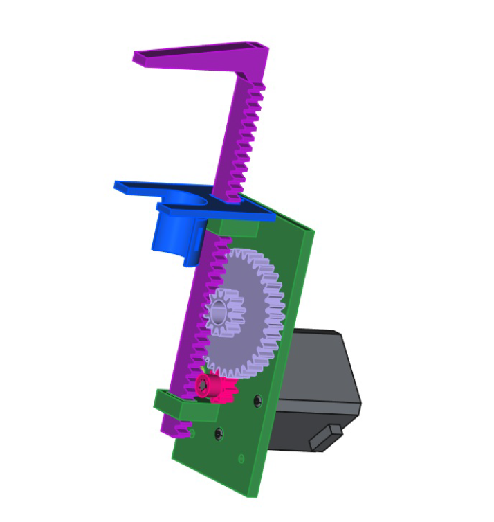
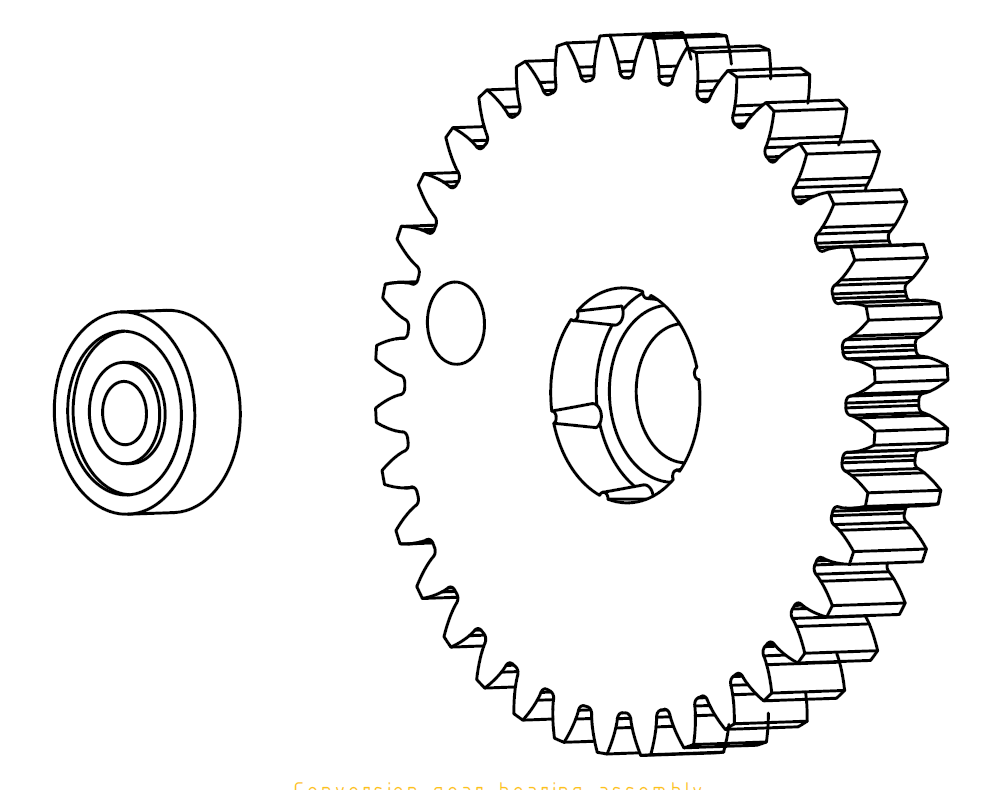
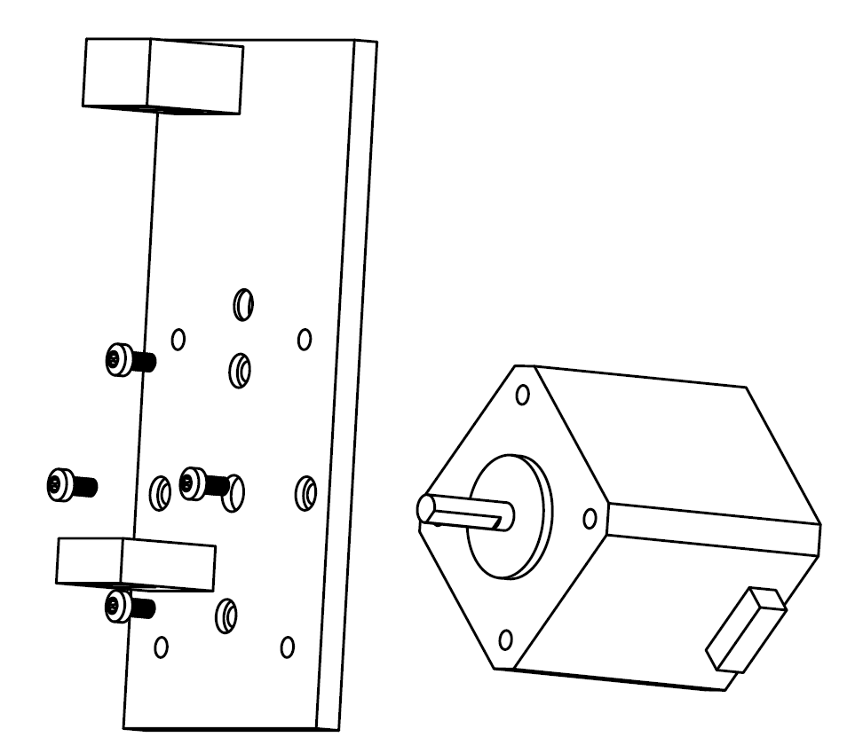
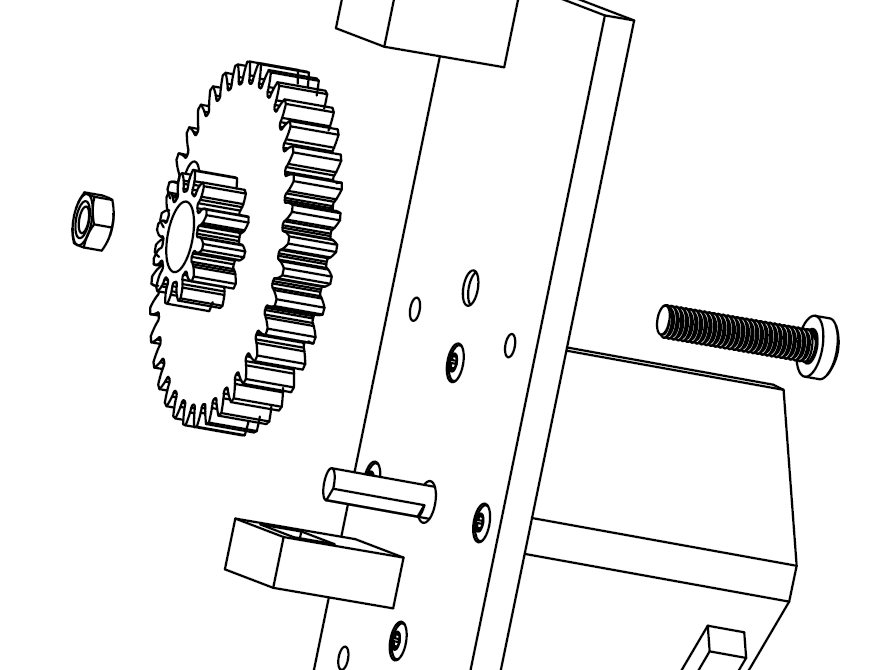
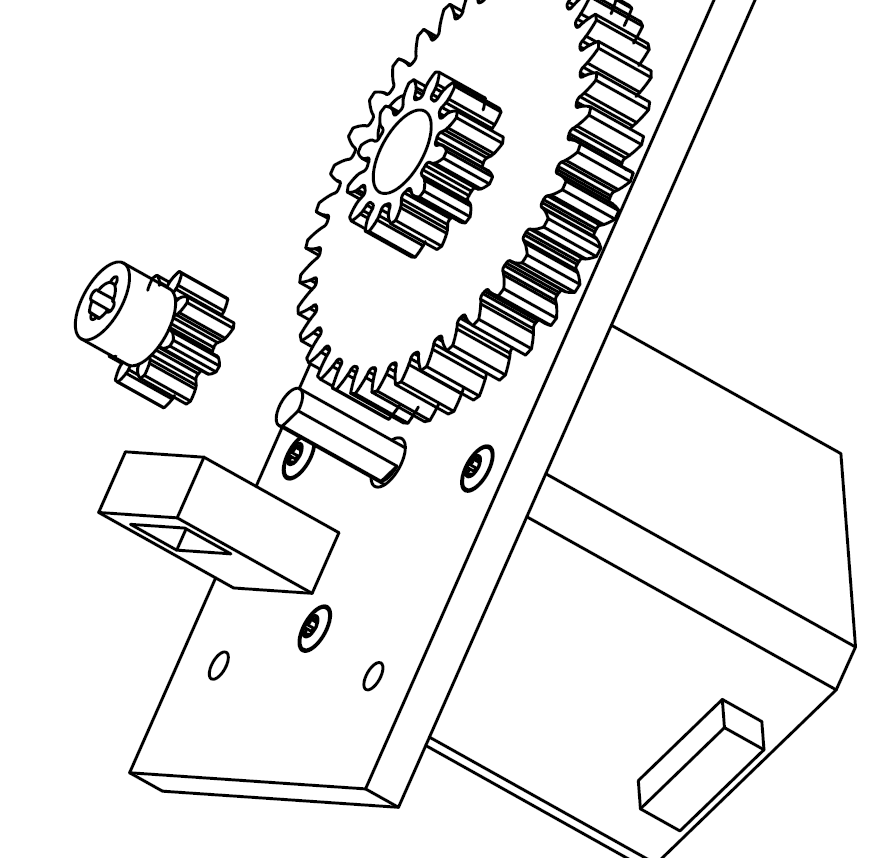
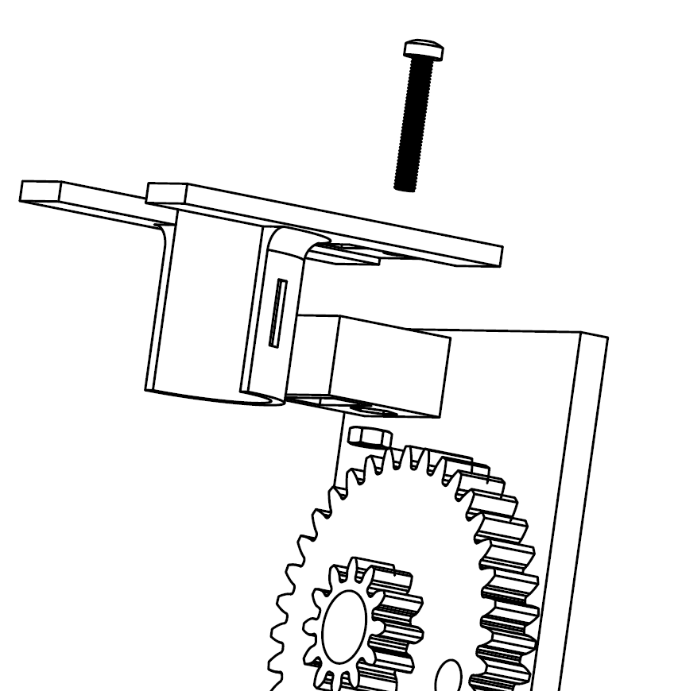
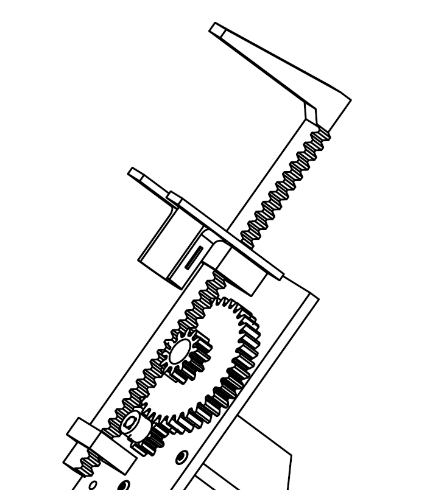

# Microlab syringe pump

This repository contains design and 3D printable files of syringe pump used in microlab as a successor to peristaltic pumps.

## Principle of operation

Syringe pump allows to dispense arbitrary amount of fluid (limited by syringe capacity) from a syringe by pressing syringe plunge using a stepper-motor powered actuator. 

Syringe is placed in a bracket (shown in blue) and locked in place using a separate attachment (not shown in picture). 

**There is a separate bracket for each syringe diameter supported. If your syringe is slightly smaller than particular bracket it should work without problems.**

### Continuous operation

In theory such pump could operate to pump "infinite" amount of fluid by adding a valve to a syringe and using different actuator that could move syringe plunge up and down. This is not supported now but it is a possibility for the future.

## Bill of Materials

In addition to 3D printable parts from this repository, you also need:

- Nema 17 stepper motor
- 625ZZ bearing (5x16x5 mm) - it is the same bearing that is used in V-Slot/3D printer wheels.
- 4 x M3x6 pan head hex screws for mounting Nema 17 motor (ISO 7380)
- M5x20 pan head hex screw and nut (ISO 7380)
- M3x20 screw and nut (type does not matter)

## 3D printing considerations

Although not mandatory - we highly recommend proper tuning of your 3D printer flow and dimension accuracy.

### Material
Both PLA and PETG were tested and are sufficient.

### Slicing

Below recommended printing settings apply to Cura slicer - other slicers may use different names for those settings.

- Layer height: 0.2 mm
- Perimeters (walls): at least 5 for gears and syringe actuator
- Infill: 20% or more
- Cooling: try at least 40-60% when printing base plate (unless you have no problems with printing overhangs)

### Supports
Supports are needed for printing the base plate. 

If there is too much  sag on a motor pad overhangs there may be problems with proper motor alignment. If you struggle to get good supports (as most people do) here are Cura settings worth trying:

- Support density: 15%
- Support Z Distance: 0.2 mm
- Support X/Y distance: 1.5 mm
- Enable support interface: Checked
- Enable support roof: Checked (may not show in slicer, don't worry)
- Support interface density: 15%
- Support interface pattern: Zig-Zag (this is most important setting!!)

## Assembly instructions

### 1 - Insert bearing into conversion gear

You may need to use some force, there are special crush-ribs designed in the hole to deform while inserting the bearing to hold it tight. Make sure bearing is placed evenly.

### 2 - Screw motor to the back plate

Use M3x6 screws.

### 3 - Attach conversion gear to the back plate

Use M5x20 screw and nut. You will most likely need to hold the nut in place using small pliers or a screwdriver while tighening the screw. 

If the bearing does not sit evenly in the gear, the gear may not rotate freely and grind on the plate - you need to realign the bearing then. In some rare cases, like out of spec bearing, you may need to add a M5 washer between bearing and the plate to rise the gear a little.

### 4 - Attach motor gear

Insert smaller gear onto motor shaft. You may also need to use some amount of force.
Please note that there is only one position where gear hole matches the shaft shape.

### 5 - Attach syringe bracket

Attach syringe bracket using M3x20 screw and nut.

### 6 - Attach syringe actuator

Insert syringe actuator through both guide holes.

## Custom syringe diameter support

If you need syringe bracket with diameter not supported by available files, you can easily generate it yourself using FreeCAD.

Open design file with FreeCAD, go to syringe bracket object. Syringe bracket is parametric - just set desired diameter in "Config" varset, wait till object regenerates and export it to STL/STEP file.

## FAQ

### Motor is too weak to press a syringe plunge.
Make sure pump is not locked - by manually rotating small gear. 

Do it when motor is disabled from power - depending on controller, motor may be activated all the time, even when not moving - and making it impossible to rotate by hand.

Possible causes why motor may be too weak:
- Stepper motor driver uses so called "microstepping" which makes motor more silent and precise. Microstepping reduces motor torque. Try disabling microstepping or at least reducing the microstep ratio.
- Too small motor current. Check motor and motor driver datasheets to verify the maximum current they can handle. If possible, increase motor current as it will increase the torque.
- Compare your motor's model datasheet specification (torque) with other Nema 17 motor models. If your model has abnormally lower torque than other models, it may be the case.
- Try reducing motor speed while pumping

As experiments show - 17HS4401 motor running at 1A current has enough torque to easily move a syringe plunge at wide range of speeds.

### Pump damages itself or syringe when pumping beyond end of syringe capacity

Pump is designed and tested to not do any damage when pumping beyond syringe capacity. Motor is expected to stop moving and start skipping steps when there is no way to move gears.

**If syringe bracket is breaking, try printing it with larger infill percentage and more top/bottom layers.**

If motor torque is too large and causes locked pump or syringe to be damaged, try lowering motor current by reconfiguring stepper motor driver. Refer to motor and driver data sheets for safe current ratings. Running motor **below** its nominal current specified in datasheet is perfectly fine.

**This pump was only tested with plastic syringes. You are using glass syringes at your own risk (as everything else here anyway).**