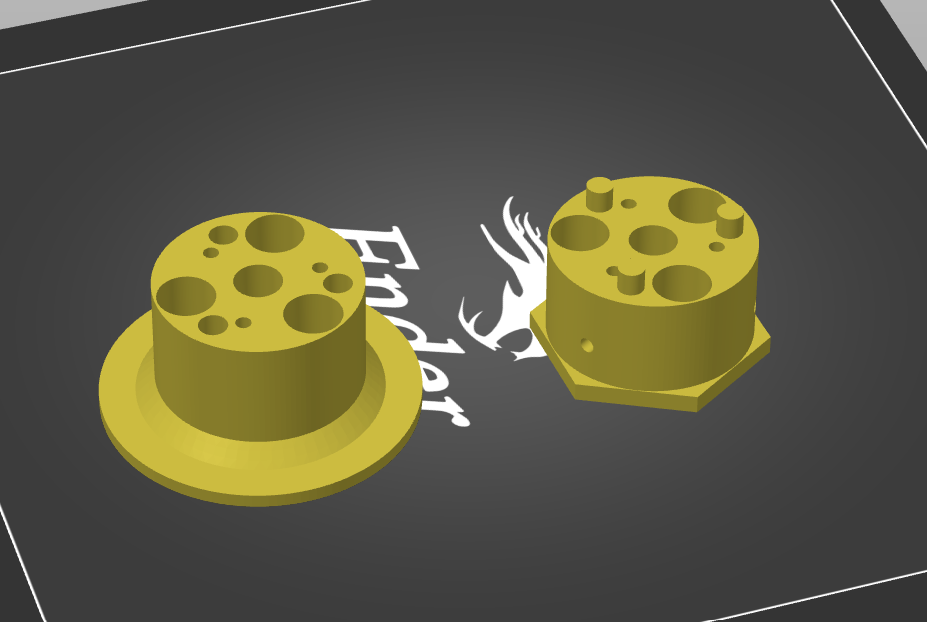

### Manifold core

Manifold core comes in 2 versions - regular and split. Split one consists of two parts (top and bottom) which can be printed separatedly and glued.

For some people it may be more handy and faster than printing reguar core which requires large supports 
(you would still need small supports for screw nut pockets).

