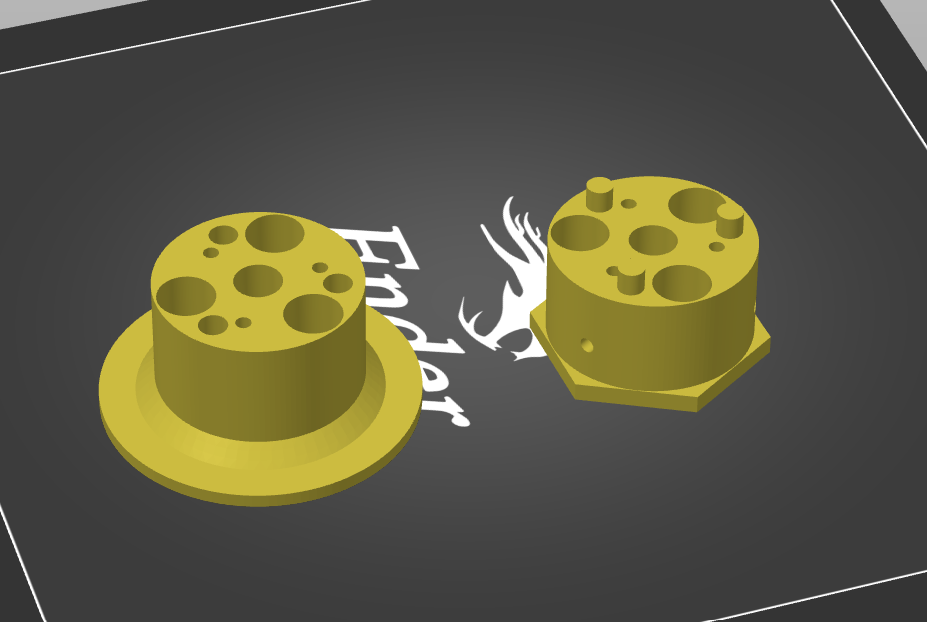

### Manifold core

Manifold core comes in 2 versions - regular and split. Split one consists of two parts (top and bottom) which can be printed separatedly and glued.

For some people it may be more handy and faster than printing reguar core which requires large supports 
(you would still need small supports for screw nut pockets).

### GL45 alternative core

This experimental design uses a borosilicate media bottle with GL45 threads as the inner vessel and a hand-cut teflon disk as the lid to improve chemical compatibility. Because the sealing surface is the bottom of the teflon disk, not the edges, tight tolerances are not required.

A 3D-printed motor-to-stir-shaft adapter is included, but the metal adapter in the main parts list may be preferred.

